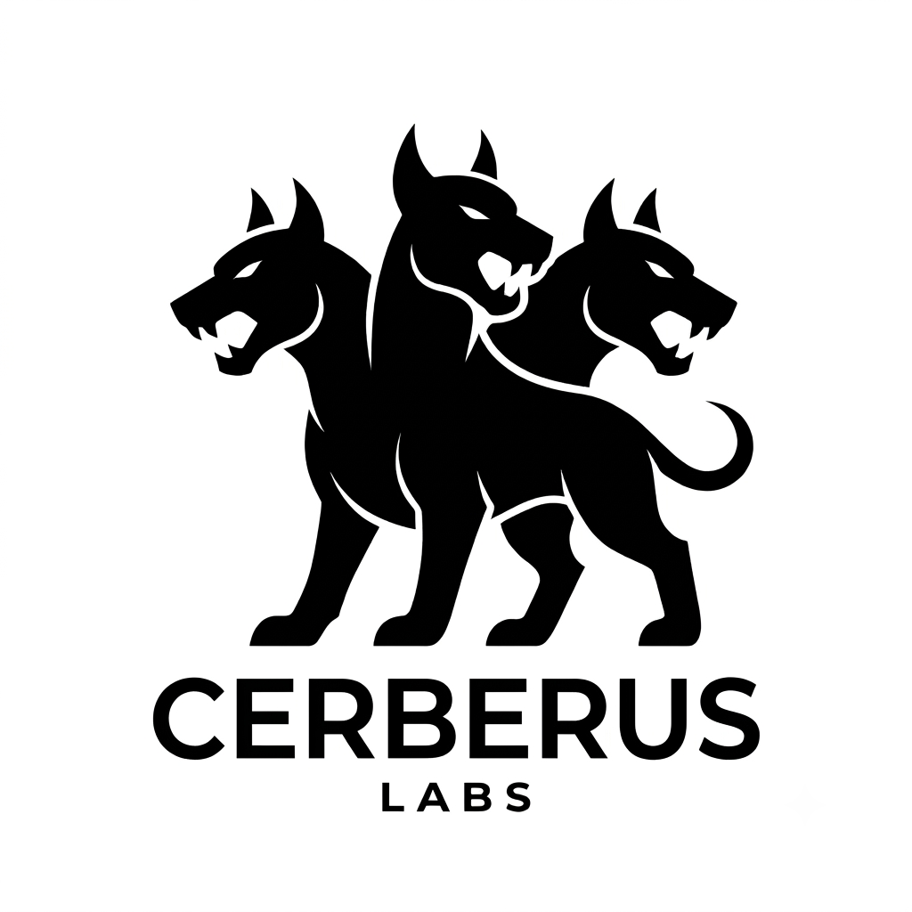

<p align="center">
  
</p>

<h1 align="center">Cerberus</h1>

<p align="center">
  <a href="https://github.com/murderszn/cerberus/actions/workflows/ci.yml"></a>
  <a href="https://github.com/murderszn/cerberus/stargazers"></a>
  <a href="https://github.com/murderszn/cerberus/network"></a>
  <a href="https://github.com/murderszn/cerberus/issues"></a>
  <a href="https://github.com/murderszn/cerberus/blob/main/LICENSE"></a>
</p>

<p align="center">
  <strong>HIGH-RIGOR REPO EXAMINATIONS | ZERO TRUST | AGENT ORCHESTRATED</strong><br>
  <em>Rigorous, real-time security certification for vibe-coded and rapid-deployment applications.</em>
</p>

<p align="center">
  <a href="#what-is-cerberus"><strong>About</strong></a> &bull;
  <a href="#running-it"><strong>Run a Scan</strong></a> &bull;
  <a href="#the-agent-swarm"><strong>Meet the Swarm</strong></a> &bull;
  <a href="#architecture"><strong>Architecture</strong></a> &bull;
  <a href="#developer-guide"><strong>Developer Guide</strong></a>
</p>

---

## What is Cerberus?

**Cerberus** is an automated, zero-configuration security scanner designed for modern, rapid-deployment engineering teams. As developers leverage AI assistants to ship features in minutes, security reviews are frequently compromised. Cerberus replaces slow, costly human auditing with a high-rigor, collaborative **AI agent swarm** that validates code, infrastructure, and configuration against a comprehensive checks catalog.

It operates entirely client-side with **no server, no build step, and no signup**:
- **The Web App ([index.html](file:///Users/jahflyx/cerberus/index.html))** runs completely in your browser, analyzing public GitHub repositories using the GitHub API. It features real-time progress indicators, interactive check filters, history persistence, and shareable deep links.
- **The CLI ([examine.py](file:///Users/jahflyx/cerberus/examine.py))** is a single Python 3 file with zero third-party dependencies, perfect for local directories, private repositories, and CI/CD pipelines.

Both interfaces consume the exact same unified check catalog, ensuring perfectly consistent results whether you scan from a terminal or a dashboard.

---

## Target Audience & Personas

Cerberus is built to serve three core workflows:

* 🚀 **The Vibe-Coding Founder**: You're building application logic at lightning speed with AI. Cerberus gives you a push-button, zero-setup audit to secure your platform, identify hidden vulnerabilities, and build immediate trust with your users.
* 📋 **The Compliance-Ready Lead**: You're preparing your startup for **SOC 2, HIPAA, or GDPR** audits. Cerberus provides a structured, scored report detailing infrastructure gaps and data security flaws.
* 🔍 **The Tech-Focused VC Partner**: You need to run technical due diligence on a target investment. Cerberus lets you rapidly inspect a repository's code quality, risk vectors, and dependency posture without configuring development environments.

---

## Key Features

- **Swarm Orchestration**: Nine specialized, non-overlapping agents audit separate layers of your system, from Code Analysis to Network Config.
- **Deterministic Verification**: Every vulnerability is mapped to a concrete, verifiable failure condition. This drastically reduces the noise and false positives common in legacy static analysis.
- **Unified Engine**: Both the web dashboard and CLI execute the same rules from [`checks.json`](file:///Users/jahflyx/cerberus/checks.json), emitting matching `cerberus.report/2` reports.
- **Frictionless Integration**: Drop a repository URL in the browser, run it locally via a terminal, or gate pull requests in CI/CD using `--fail-under`.

---

## Running It

### 🌐 Web App (GitHub repositories only)

Simply open [index.html](file:///Users/jahflyx/cerberus/index.html) in any modern browser, or serve the repository root using any static file server:

```bash
python3 -m http.server 8000
```

Then visit `http://localhost:8000` and paste any public GitHub repository URL.

> [!NOTE]
> Due to browser CORS policies, the web app can only fetch public repositories. To scan private repositories, input a GitHub **Personal Access Token (PAT)** in the provided web UI field, or use the CLI.

---

### 💻 CLI (`examine.py`) — Local Directories, Private Repos, and CI

Run the scanner directly from your terminal. Since it is a raw Python 3 script, there is no installation step:

```bash
python3 examine.py <path-to-local-directory-or-github-url>
```

#### CLI Reference & Flags

| Flag | Argument | Description |
| :--- | :--- | :--- |
| `--json` | `path` | Write the complete, raw JSON report (matches the `cerberus.report/2` schema). |
| `--html` | `path` | Output a standalone, interactive HTML report. |
| `--sarif` | `path` | Generate SARIF format output to upload directly to GitHub Code Scanning. |
| `--fail-under` | `score` | Exit non-zero if the final score is below the threshold (e.g. `80`) — perfect for blocking failing PRs. |
| `--only` | `agents` | Restrict evaluation to a comma-separated list of agent IDs (e.g. `sentinel,vault`). |
| `--severity` | `level` | Filter terminal output to show only findings at or above `critical`, `high`, `medium`, or `low`. |
| `--quiet` | *None* | Suppress file listings and print only the final score and grade. |
| `--no-color` | *None* | Disable ANSI color output in the terminal. |

#### Example: GitHub Actions CI/CD Integration

To run Cerberus on every pull request and upload findings directly to GitHub's Security tab:

```yaml
# .github/workflows/cerberus.yml
name: Cerberus Security Scan
on: [pull_request]

jobs:
  security-scan:
    runs-on: ubuntu-latest
    steps:
      - name: Checkout Code
        uses: actions/checkout@v4

      - name: Set up Python
        uses: actions/setup-python@v5
        with:
          python-version: "3.x"

      - name: Run Cerberus Scanner
        run: python3 examine.py . --sarif cerberus.sarif --fail-under 80

      - name: Upload SARIF Report
        uses: github/codeql-action/upload-sarif@v3
        if: always()
        with:
          sarif_file: cerberus.sarif
```

---

## The Agent Swarm

The scan logic is divided among **9 specialized security agents**. Each agent owns a specific domain, evaluates a dedicated set of rules, and starts with a max weight. Failed checks subtract points from that agent's weight based on check severity (capped per check), and the agent scores are summed to produce a final score from `0` to `100`.

| Agent | Domain | Target Focus | Weight | Active Checks |
| :--- | :--- | :--- | :---: | :---: |
| 🛡️ **SENTINEL** | Code Analysis | Vulnerable code patterns, injection points, unsafe functions | **14** | 11 checks |
| 🔑 **VAULT** | Data Security | Exposed secrets, unencrypted databases, hardcoded credentials | **13** | 8 checks |
| 🚪 **GATEKEEPER** | Access Control | Authentication, CORS misconfigurations, broken authorization | **12** | 6 checks |
| 📦 **LIBRARIAN** | Dependencies | Deprecated packages, lockfile presence, vulnerable versions | **12** | 6 checks |
| 📡 **CONDUIT** | Network & API | Cleartext communication, insecure HTTP methods, API keys | **11** | 5 checks |
| 🔭 **WATCHTOWER** | Application Config | Environment variables, debug flags, configuration safety | **11** | 8 checks |
| 🖥️ **SHIELD** | Client Security | XSS vectors, CSRF, insecure client-side session management | **11** | 6 checks |
| 📝 **AUDITOR** | Logging & Monitoring | Verbose logging, lack of audit trails, missing security contacts | **8** | 4 checks |
| 🏗️ **ARCHITECT** | Infrastructure | Dockerfile practices, IaC misconfigurations, root privileges | **8** | 5 checks |
| **Total** | | | **100** | **59 checks** |

### Grading Rubric
- **A**: $\ge$ 90
- **B**: $\ge$ 80
- **C**: $\ge$ 70
- **D**: $\ge$ 60
- **F**: $<$ 60

---

## Architecture

```
                 [ checks.json ] (Single Source of Truth)
                        │
         ┌──────────────┼──────────────┐
         ▼              ▼              ▼
   [ Web App ]     [ CLI Tool ]   [ Doc Generator ]
   (index.html)    (examine.py)   (generate-checks-docs.py)
         │              │              │
         ▼              ▼              ▼
    HTML Report    JSON/SARIF/HTML   documentation/checks.html
```

- **[`checks.json`](file:///Users/jahflyx/cerberus/checks.json)** is the single source of truth. It defines the ID, agent, severity, CWE mapping, and regular expression detectors for every check. No agent or UI contains hardcoded security rules.
- **[`assets/scanner.js`](file:///Users/jahflyx/cerberus/assets/scanner.js)** reads the rules and evaluates them concurrently (up to 8 files at a time) against downloaded repository files.
- **[`examine.py`](file:///Users/jahflyx/cerberus/examine.py)** parses the same rules and evaluates them locally.
- **[`scripts/generate-checks-docs.py`](file:///Users/jahflyx/cerberus/scripts/generate-checks-docs.py)** compiles the JSON catalog into customer-facing markdown files (`docs/scanner-checks.md`) and HTML sites (`documentation/checks.html`).

---

## Developer Guide

### Rebuilding Assets and Docs

If you add, remove, or modify checks in [`checks.json`](file:///Users/jahflyx/cerberus/checks.json):

1. **Rebuild Web Assets**:
   Run the build script to compile the JSON catalog into `assets/checks.js` for browser consumption:
   ```bash
   python3 scripts/build-checks.py
   ```

2. **Regenerate Documentation**:
   Run the documentation generator to update the static HTML documentation site and local markdown reference:
   ```bash
   python3 scripts/generate-checks-docs.py
   ```

3. **Verify Locally**:
   Run the CLI scanner on the local repository to test your changes:
   ```bash
   python3 examine.py .
   ```

---

## Repository Structure

* [index.html](file:///Users/jahflyx/cerberus/index.html) — The web dashboard scanner.
* [ceberus-classic.html](file:///Users/jahflyx/cerberus/ceberus-classic.html) — The legacy static HTML scanner page.
* [examine.py](file:///Users/jahflyx/cerberus/examine.py) — The Python CLI scanner.
* [checks.json](file:///Users/jahflyx/cerberus/checks.json) — The unified check catalog rules engine.
* [logo.png](file:///Users/jahflyx/cerberus/logo.png) — The official Cerberus Labs logo.
* [assets/](file:///Users/jahflyx/cerberus/assets/) — Core JS assets including [`scanner.js`](file:///Users/jahflyx/cerberus/assets/scanner.js) and [`checks.js`](file:///Users/jahflyx/cerberus/assets/checks.js).
* [documentation/](file:///Users/jahflyx/cerberus/documentation/) — Static documentation site.
* [docs/](file:///Users/jahflyx/cerberus/docs/) — Additional specification docs (e.g. [`brand.md`](file:///Users/jahflyx/cerberus/docs/brand.md), [`IMPROVEMENTS.md`](file:///Users/jahflyx/cerberus/docs/IMPROVEMENTS.md), compliance guides).
* [scripts/](file:///Users/jahflyx/cerberus/scripts/) — Internal developer tools, test runners, and doc generators.

---

## Active Roles

- **Joshua Johnson** — CEO / CFO
- **Caleb Johnson** — COO
- **Elijah Johnson** — CTO
